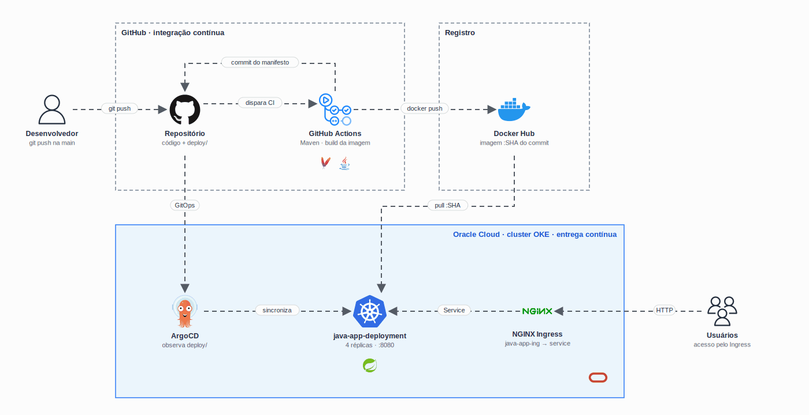

<h1 align="center">
  CP2 - CI/CD com GitOps na Oracle Cloud
</h1>

<p align="center">
  
</p>

<p align="center">
  
</p>

## Qual a finalidade do projeto?

Checkpoint 2 da disciplina de **DevOps** (FIAP, 2º semestre de 2025). O projeto demonstra uma esteira completa de **CI/CD** para uma aplicação Java, do `git push` até o **Kubernetes na Oracle Cloud (OKE)**, sem nenhum passo manual de deploy.

A proposta é aplicar o modelo **GitOps**: o **GitHub Actions** cuida da integração contínua (build, imagem e publicação) e o **ArgoCD**, rodando dentro do cluster, cuida da entrega contínua, mantendo o ambiente sempre igual ao que está versionado no repositório.

Cada imagem publicada recebe como tag o **SHA do commit** que a gerou. O próprio pipeline atualiza o manifesto do Kubernetes com essa tag, então dá para saber exatamente qual versão do código está no ar e voltar para qualquer versão anterior revertendo um commit.

## O que foi construído

### Aplicação

| Camada | Descrição |
|---|---|
| Backend | Aplicação **Spring Boot 3** (Java 17) que responde uma página HTML em `/` |
| Build | **Maven** gerando o `demo-0.0.1-SNAPSHOT.jar` |
| Container | Imagem Docker baseada em `eclipse-temurin:17-jre`, exposta na porta `8080` |

### Pipeline

| Etapa | Descrição |
|---|---|
| Gatilho | `push` na branch `main` |
| Build | `mvn -B package` com JDK 17 (Temurin) |
| Imagem | `docker build` e `docker push` para `willtechdev/fiap-devops-cp2:<SHA>` |
| Manifesto | Gera `deploy/deployment.yaml` a partir do `deployment-template.yaml` e faz o commit da nova tag |
| Deploy | ArgoCD detecta o commit e sincroniza o cluster |

### Infraestrutura

| Área | Descrição |
|---|---|
| OCI | Cluster Kubernetes gerenciado no **OKE** |
| GitOps | **ArgoCD** instalado no namespace `argocd`, observando a pasta `deploy/` |
| Deployment | `java-app-deployment` com **4 réplicas**, requests `100m`/`256Mi` e limits `200m`/`512Mi` |
| Service | `java-app-service` do tipo `ClusterIP` na porta `8080` |
| Ingress | `java-app-ing` com **NGINX Ingress Controller**, roteando `/` para o service |
| Registro | **Docker Hub** guardando uma imagem por commit |

## Tecnologias utilizadas

- **Java 17 + Spring Boot 3:** aplicação web;
- **Maven:** build e empacotamento do `.jar`;
- **Docker:** empacotamento da aplicação em imagem;
- **Docker Hub:** registro das imagens publicadas pelo pipeline;
- **GitHub Actions:** integração contínua (build, imagem, push e atualização do manifesto);
- **ArgoCD:** entrega contínua no modelo GitOps;
- **Kubernetes (OKE):** execução da aplicação na Oracle Cloud Infrastructure;
- **NGINX Ingress Controller:** entrada HTTP do cluster.

## Estrutura do repositório

```text
fiap-devops-cp2/
├── .github/workflows/
│   └── docker-image.yml         # Pipeline de CI no GitHub Actions
├── deploy/
│   └── deployment.yaml          # Manifestos gerados pelo CI e lidos pelo ArgoCD
├── docs/
│   ├── arch.gif                 # Diagrama animado da arquitetura
│   └── stack.svg                # Ícones das tecnologias
├── src/main/java/
│   └── DemoApplication.java     # Aplicação Spring Boot
├── deployment-template.yaml     # Deployment, Service e Ingress com o placeholder ${IMAGE_TAG}
├── Dockerfile                   # Imagem eclipse-temurin:17-jre com o .jar
├── pom.xml                      # Build Maven (Java 17, Spring Boot 3)
└── README.md                    # Visão macro do projeto
```

## Fluxo de funcionamento

1. O código da aplicação é versionado no GitHub e enviado para a `main`.
2. O push dispara o workflow **CI Pipeline** no GitHub Actions.
3. O Maven compila a aplicação e gera o `.jar`.
4. O Docker gera a imagem com a tag do SHA do commit e publica no Docker Hub.
5. O workflow substitui `${IMAGE_TAG}` no `deployment-template.yaml` e faz o commit do `deploy/deployment.yaml`.
6. O ArgoCD, instalado no cluster OKE, detecta a mudança na pasta `deploy/`.
7. O ArgoCD aplica o Deployment, o Service e o Ingress, e o Kubernetes faz o rollout das 4 réplicas.
8. O NGINX Ingress Controller expõe a aplicação para os usuários.

## Como validar a entrega

Em uma validação end-to-end, uma alteração no código enviada para a `main` deve chegar ao cluster sozinha: o workflow termina com sucesso, o Docker Hub recebe uma imagem nova com o SHA do commit e o ArgoCD mostra a aplicação **Synced** e **Healthy** com a nova versão.

Pontos principais de validação:

- workflow **CI Pipeline** concluído com sucesso no GitHub Actions;
- imagem `willtechdev/fiap-devops-cp2:<SHA>` publicada no Docker Hub;
- commit automático do `deploy/deployment.yaml` com a nova tag;
- aplicação **Synced** e **Healthy** na interface do ArgoCD;
- 4 pods em execução (`kubectl get pods`);
- aplicação respondendo pelo endereço do Ingress (`kubectl get ingress`).

## Autor

**William Alves Coelho** · [@willtechdev](https://github.com/willtechdev)
